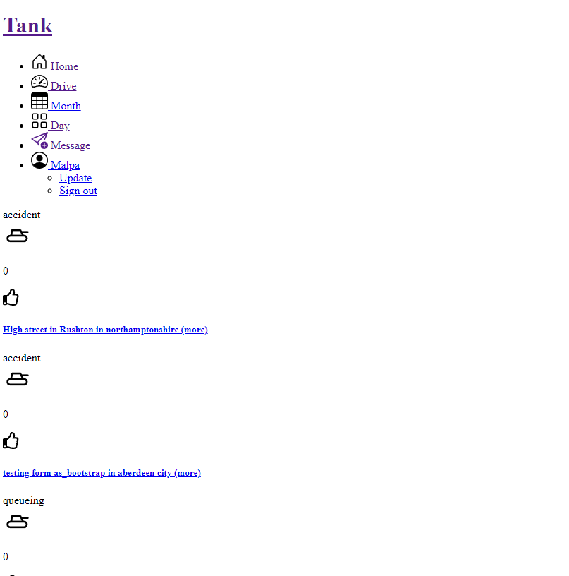
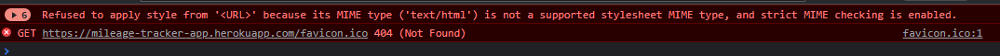

# Contents

[Tank Mileage Tracker](#tank-mileage-tracker)


[UX](#ux)
+ [User Stories](#user-stories)
+ [Wireframes](#wireframes)

[Existing Features](#existing-features)
+ [Navbar](#navbar)
+ [Home Page](#home-page)
+ [Results Page](#results-page)
+ [Contact Page](#contact-page)

[Future Features](#future-features)

[Technologies Used](#technologies-used)
+ [Languages Used](#languages-used)
+ [Frameworks, Libraries & Programs Used](#frameworks-libraries-and-programs-used)

[Code Validation](#code-validation)
+ [Automated Tests](#automated-tests)

[Project Bugs and Solutions](#project-bugs-and-solutions)

[Deployment](#deployment)
+ [Forking the GitHub Respository](#forking-the-github-repository)
+ [Making a Local Clone](#making-a-local-clone)


[Credits](#credits)
+ [Content](#content)
+ [Media](#media)

# Tank Mileage Tracker

[](??? link to live website)

Click [here](???) to live site.  

## UX

The app aims to record daily mileage for each journey.

Workflow 1.
App can be used every day for each journey and the driver can save each route as they go. 
  - log in
  - go to "drive"
  - put in start and destination
  - be transfered to map preview page
  - add to database
  - click to go to maps (google maps on mobile or google maps website on desktop)
  - they arrive at destination
  - to go to next location, they need to go back to the Tank website (they would still be on map preview)
  - go back to "drive"
  - put in start and destinaton

This workflow requres too many steps - need to improve on this
This workflow requires the driver to juggle beetween google maps and Tank website and the work app that tells him the next address. 

This workflow makes sure that driver:
  - adds each journey to database (because he puts the address in Tank website instead of google maps) 
  - currently the driver needs to open work app - look up destination address and type postcode to google map.
  - with Tank website he needs to type the address and it allows him quickly to add the journey to database and get transfered to maps

Because the Tank website forces the user to regular use every day during the whole shift - it can be a good platform for:
  - trafficc messages
  - in work messages
  - tracking employer's progres in mileage reporting
  - advertising (if app is to be used commercialy)

Database:
  - each journey is saved as seperate position with start and destination saved with the distance.

Workflow 2
  - if drived didn't put in mileage for a particular day - needs to put in mileage in bulk

Workflow 3 
  - if driver has checked their daily report and realises he forgot to add one destination in the middle of the route. 

## Workflow decisions

I dropped the map view as it has not been bringing any value for a driver / mobile phone user. The driver needs an interactive map in a google maps app, not a display javascript area inside a website. 

I have simplified the Drive View.

1. user clicks on drive on nav bar
2. user uses date picker to choose date of the journey
3. user types start and end address
4. user clicks button GO
5. user gets transfered to Drive Next view
  -  with the accordeon of the current journey with a button to google maps app
  - with form to input next journey - pre filled on journey_start side
  - with a list of all journeys for this date.

### User Stories

+ As a user, I would like to be able to …
[#107](https://github.com/JoGorska/mileage-tracker/issues/107)


1.  the information to be clear and informative;
2.  the website be easy to navigate;


### Wireframes 

Wireframes created with Balsamiq. The project was developed from initial wireframes and some modifications were made during the development process to assure better usability. 

[Wireframes](???)

## Existing Features 

### Navbar and Footer

+ Navbar and footer has been copied from Bootstrap components and adjusted to the needs of the project
+ Navbar collapses into a hamburger button for easy navigation on mobile devices.
+ 

### Home page 

Traffic alert design - I've chosen a simple card design from bootstrap. I have also chosen to stack up the cards for larger screens to see two beside each other.
Since this is an app for driver I have taken the mobile first aproach. This app needs to be comfortable to use by someone that is using mobile phone only. This led to a decision to display only maximum of 4 messages per page. This way the mobile phone user will not have to scroll down too much, but there is an option to go to the next page.


### Drive Page

Drive page is divided into 4 sections
1. Current journey
2. form to input start and destination address
3. List of journeys for the current date
4. List of traffic messages

1. **Current Journey**
  This field displays only if user has come to drive after submitting another journey. The user gets data from the current journey to fill in a accordeon style table with start and destination postcodes and distance. 

  This accordeon button is styled with orange to distinguish it visually from the list of journeys of the day. The button also features an old google maps icon that was taken from [here](https://icons8.com/icon/32215/google-maps-old) The icon is linked up with the destination address of the current journey. 

  The logic of this is that once the user types in start and destination address - the data gets saved in the database and he can now go to maps and drive. This works nicely on the mobile as user gets transferred to google maps with this address already inputed. This uses the geocoordinates to set the google maps up with destination. 

  The icon is featured with little description available for large and medium screens. This was due to the fact that on larger screens the accordeon button is so long and large that this icon gets lost at the end of it with a big gap in between the description of the journey and the icon. 

  For mobile phones this description was not needed as the responsive grid pushes the icon right next to the table which makes it quite intuitive. 

  Once the user opens the accordeon button he can see the full address start and destination as well as buttons to edit or delete the journey. 

2. **Form to input start and destination address**
javascript validation on input with helper text apearing in red or green

django form validation 

django validation - error messages
            else:
                # this captures any other errors that might apear, it displays a message
                # containing <ul> of all errors and fields associated with them.
                # this should be handled by html atribute "required",
                # but this one is just in case
                messages.error(request, form_errors)

### Contact Page

### Form validation


## Future Features 


## Technologies Used

### Languages Used

   + HTML5
   + CSS3
   + JavaScript

 ### Frameworks Libraries and Programs Used

+ Balsamiq:
    Balsamiq was used to create the wireframes during the design process.
+ Bootstrap 5:
    Bootstrap was used to add style to the website.
+ Git
    Git was used for version control by utilizing the Gitpod terminal to commit to Git and Push to GitHub.
+ GitHub:
    GitHub is used to store the project's code after being pushed from Git.


## Code Validation

### Automated tests

### Manual tests

1. First set of manual testing on Version 1

  * Initial version did not have submit button, but the form has been submitted automaticaly, this was assessed negatively, as the user likes to have control over when he goes to the next page. 

  I have added the button to submit the addresses

  * Initial version requred user to submit data on the address input form, than submit data on the map page. Users complained that the process is very complicated and, when user was observed interacting with the page, it became obvious that he is lost as to what to do on the Map page. 

  I have dropped the Map page and I have the one button fetching data from google directions and submitting to the database in one go. I also thought that javascript google map is not of any value to mobile phone user, as he can't use it to drive. User needs a button to click and be transfered to google maps and use it as Sat Nav. 

  User was unaware that he had the option to click into the link and be transfered to google maps. The link was white letters on dark background and didn't stand out. 

  I have added a google maps icon with geocoordinates for user to click so he can intuitivly use this option. 

  * Initial testing have revealed that google places drop down sometimes doesn't apear. It might have been caused by [Dark Raider](https://chrome.google.com/webstore/detail/dark-reader/eimadpbcbfnmbkopoojfekhnkhdbieeh/related?hl=en) chrome extension, although further tests have excluded this. 

  I have added javascript validation on input that guides the user through helpfull messages 
  - Please click into the drop down field to choose the correct address
  - This field is required
  - We have found geocoordinates
  Positive message is in green, negative are in red.

  Should the user still decide to submit the form with the red errors he gets a long message from django form validation that is customised, depending on error type. 

  * Users also noticed that new traffic alerts aren't showing on the traffic alerts list. 

  I have found the error in the code, new messages were submitted as "draft" not "published" therefore they were not shown on the list. I have made all new traffic alerts created with the status "published"

  * Users pointed out that the "month" button in nav bar isn't working

  This functionality wasn't ready for the first realease

  * Users appraised the dark theme of the website and the general design. 

  * Users didn't like the fact that nav bar wasn't folding into a button for mobile phone. The fact that the icons were troppind down in un organized way was particulary distracting. 

  Since this app is directed for mobile phone users mainly I have build special dedicated nav bar for mobile only. I have used media query to show and hyde the nav bars appropriately.

2. Set of tests Version 2 (new-drive branch)

* user spotted error in the link in the button that is supposed to take him to the destination address on google maps.

I've noticed that this link has variables that were in previous release, updated variables to up to dates, geocoordinates are now loading correctly.

* user was observed interacting with the app. As soon as he clicked onto the start adress input field, the keyboard showed up and the user started typing the postcode. The user didn't realised that under the keyboard there was a drop down box to click into. 

The user was using particulary small phone - screen witdht 320px

I added autofocus to the start address input element. Hopefuly this will scroll the element automaticaly to the top of the page. 

* footer was covering lots of content of the drive page, fotter was made non sticky as it doesn't contain any vital information that driver would need in every day use. 

3. Sets of tests Version 3
* edit_journey - was adding new journey, instead of editing it - I fixed this error
* footer is no longer covering content, but it floats half way through the page - like in date pickers, still floats on login ??? 
* user complained that his email is visible when he posts traffic alert - changed this to display first name only.
* drive - add journey - when user clicks on the map - the accordeon automaticaly opens and there is too much information for a small mobile to display. Also once the accordeon on orange box current journey opens, the form to add next journey goes down below and user has to scroll. 

## HTML validation
+ HTML

  Passing the HTML from all templates and base into the W3C Markup Validator no errors or warnings have been found [W3C validator](https://validator.w3.org/).


+ CSS

No errors were found when passing through the official [W3C validator](https://jigsaw.w3.org/css-validator/). 
        

+ JavaScript

Javascript files were tested with the jshint and no errors were been found. 

+ Python
## Form validation

Drive

### custom validation attempt

            # IF USER fiddles with the input form, but chooses not to click into the
            # google drop down box, or the drop down box doesn't apear when he edits the 
            # input field, than the geocoordinates would lead to a different address than
            # stated in the input field

            # I need to add javascript / jquery to show green and red message under
            # the input field
            # I  can test if the start adress field matches the directions.origin ??? !!!

            # please click into drop down field below. If drop down box doesn't apear, you might need to re load the page
            # some browsers extension might prevent the drop down from apearing for example ... dark???
            # you might need to disable this extension if you wish to continue using Tank Mileage Tracker
```
            address_start_form_data = request.POST.get("address_start")
            address_destination_form_data = request.POST.get("address_destination")
            address_start = directions["origin"]
            address_destination = directions["destination"]
            print(f'form data {address_start_form_data}')
            print(f'from google direcions {address_start}')
            if (
                address_start_form_data == address_start) and (
                address_destination_form_data == address_destination):
                
                print(f'ALL OK ADDRESS ARE IDENTICAL')
            else:
                print(f'these fields are different')
```


Unfortunately the print returned the differences that come from two different queries from google
```
form data Doncaster, UK
from google direcions 14 Prince's St, Doncaster DN1 2HJ, UK
```
- when querying google places - I might get just the town or full address
- when querying google directions - I am always getting full set of data including postcode 
-

### javascript validation for Drive

I have added Javascript function detecting input on the start address and destination address fields. The function adds and removes classes showing the user in red and green if the field is filled in correctly. 

I have also allowed html validation - by adding "required" attribute to both elements.

the "ok" status for both fields is changed by the function handling api query. Once the query is completed and data is submited to the fields this function adds and removes classes so it shows user in green that geocoodinates have been found. 

### Django validation for AddJourney

If user decides to ignore the above messages from JavaScript, the form gets submitted with some missing data, but django form validation function prevents the item to be submitted to database with missing data. 

The user gets displayed a message describing the error.

The most common error will be submitting form with geocoordinates missing. I decided that I would preffer user not to see geocoordinates as it would be too much information for a little phone application. Geocoordinates would need to be inside not editable input elements anyway. 

I am adding detailed message describing what to do if the drop down input field from google places api doesn't show up. I am also clearing the form data - hopefuly when user types both addresses again, he understands how to do this correctly. 

### Do I want to thoroughly validate date

I like the users to have the ability to add the dates in the past. The driver might have forgotted to add mileage daily and he will be forced to back date all entries.

Another question is if I should validate if the user inputs date in the future. I would like to think that this option might be usefull. I am required to submit my mileage on the last day of the month. I would write the report the previous day and submit it to employer once I finish driving. 

There might be other employers who require some kind of driving plan or predicted mileage from their employers. Employer might have to plan their journey ahead and report planned journey. 

## Project Bugs and Solutions:

### Problem with displaying form fields using |as_bootstrap

Forms with added |as_bootstrap display neatly on the page, unified with the style of the app. Unfortunately displaying form|as_bootstrap causes that fields display without proper gap between each line. The fields stick too close one above another. The label is nearly touching the field above. 

First tried to loop through each field and use |as_bootstrap, but it was returning error. This ment that I had to prepare the whole html structure of label + input + help + wrapping div with bootstrap classes to acheve bootstrap styling. I added id, name, label information using `field.`. 
```
          
            <div class="mb-3">

                <label for="{{ field.id_for_label }}" class="form-label">{{ field.label }}</label>
                <input type="field.widget_type" class="form-control" id="{{ field.id_for_label }}" aria-describedby="{{ field.id_for_label }}-help" name="{{ field.html_name }}">
                
                <div id="{{ field.id_for_label }}-help" class="form-text">{{field.errors}}</div>

             </div>
          
```
All this seemed to work and generated all fields that were needed by django model and set by forms.py, except of input type. The fields with text area or select input type just rendered as if the input type was set to text.

I tried to loop through each field, but the input type doesn't change. Django documentation about input type field ([here](https://docs.djangoproject.com/en/3.2/ref/forms/api/#django.forms.BoundField)) mentiones that field.widget_type should return the type of input.


django documentation provides example:
```
  
      
          # render one way
      
          # render another way
      
    
```
when I wrote `<input type="field.widget_type">` the page rendered with exactly the same `<input type="field.widget_type">`. It did not fill in the apropriate input type for each field. I might have to adjust forms.py to add widgets.

Even if the above works I would still have to loop throuogh options to display options in drop down. 

For now I decided to leave the forms |as_bootstraps - because they actualy work and display the content and input type correctly. This might need addressing in further development of the site.

### Unable to add "likes" to "cleared"
User is supposed to have possiblity to marked message as Road clear by clicking "cleared" icon on the traffic alert details view. The function returns error:

'ManyRelatedManager' object has no attribute 'cleared'

The cleared was created 

### requests==2.25.1

requests==2.25.1 was installed and returned error during instalation. Need to check if it affects app in any way. 
ERROR: pip's dependency resolver does not currently take into account all the packages that are installed. This behaviour is the source of the following dependency conflicts.
dj3-cloudinary-storage 0.0.6 requires requests>=2.26.0, but you have requests 2.25.1 which is incompatible.

### Link to Google Maps opens with no coordinates - resolved

when user sees the preview map, he can click bottom left corner "google" to be transferred to google app (on mobile) or google maps website (on desctop computer), unfortunately at the minute the google app/website opens with no coordinates.

read more:
https://developers.google.com/maps/documentation/urls/get-started

example url

https://www.google.com/maps/place/47%C2%B035'42.6%22N+122%C2%B019'53.9%22W/@47.5951518,-122.3316393,17z/data=!3m1!4b1!4m5!3m4!1s0x0:0xca3d37fe916595c3!8m2!3d47.5951518!4d-122.3316393

this url opens directions

the final api consists of those elements:
```

https://www.google.com/maps/dir/?api=1
&origin=
latitute
%2C
longtitute
&destination=
latitute
%2C
longtitute
```
working example:

https://www.google.com/maps/dir/?api=1&origin=51.8630529%2C0.1755065&destination=52.5000791%2C-0.7110285


### Form on map.html not saving data

I created form to save data to create instance of Journey model.
1. I tried to add data using '<input type="hidden">' but the data wasn't being saved in the form, the view didn't recognize the manualy typed input fields as actual form and wasn't taking the data of those input fields.
2. I tried to pass arguments in urls, but I strugled to find the right format to pass more than one argument. After reading the documentation I found solution [here](https://docs.djangoproject.com/en/3.2/topics/http/urls/#including-other-urlconfs), example that was given was passing multiple arguments using regular expession. Next step was to write correct expression to send the variables from form to view. I used [this](https://docs.djangoproject.com/en/3.2/topics/http/urls/#examples) example as guidance.
3. I was able to pass 3 arguments in url. If I tried to add 4th (latitute), I had error return URL not found and the url did not contain data. I wasn't able to establish the reason for this error.
4. I tried to get the latitute from map_view - latitute and longtitute are loaded on map view to URL, but I could not find the way to pass the arguments from get to post function (from map_view to add_visit)
5. I came to the conclusion that the latitude and longditute are not essential for user to have, as they are unreadable long number. The user will be needing full address and postcode. I have decided not to post data for latitute and longditute for now. 

### Problem with static files not loading on deployed site

Page was displaying white without any css or js files loaded. 




The below error was displaying on console:



Tried several solutions:

Not worked:

- import mimetypes - solution found [here](https://stackoverflow.com/questions/35557129/css-not-loading-wrong-mime-type-django) 
- changes to file path in settings and / or in base.html file, which was suggested in one of the answeres [here](https://stackoverflow.com/questions/48248832/stylesheet-not-loaded-because-of-mime-type)

- assumption that the problem is caused by CSS library starting with comments - solution found [here](https://stackoverflow.com/questions/48248832/stylesheet-not-loaded-because-of-mime-type)

Worked:

- change `DEBUG = False` - solution found [here](https://stackoverflow.com/questions/35557129/css-not-loading-wrong-mime-type-django).

- make DEBUG variable dependable on development variable. If app can find development variable in enviroment - it sets the debug to the value of the variable, if no development variable found - the debug goes to False as default. Solution proposed in [this](https://learn.codeinstitute.net/courses/course-v1:CodeInstitute+FST101+2021_T1/courseware/dc049b343a9b474f8d75822c5fda1582/00bc94313a374f519dbec8dfb7ed0fbd/) Code Institute video. 
```
development = os.environ.get('DEVELOPMENT', False)

DEBUG = development

if development:
    ALLOWED_HOSTS = ['localhost', '127.0.0.1', '127.0.0.1:8000']
else:
    ALLOWED_HOSTS = ["mileage-tracker-app.herokuapp.com"]
```
`os.environ["DEVELOPMENT"] = "True"` variable needs to be added to env.py file, while in heroku - do not add this variable at all. 

### Problem with styling the map.html template

The google javascript api map requires special setting on the body and element that will hold the map:
```
#map-route {
height: 100%;
```

Unfortunately once the bootstrap css have been applied, this setting was not correct for page to render the map. I have tried to add `!important` but this has not worked. I tried all settings that were working from oryginal map-only.css and set them all as `!important` but this has not worked either. I could see on the developer's tools that map's div was rendering, but the div size was 0px hight. I tried various different settings in dev tools in chrome but none gave right scale of the map. I wasn't able to locate which part of bootstrap's styling needs to be overriden.

In the end I decided to style this page similarly as bootstrap looks - same background color and fonts. I have also styled javascript map in night mode to blend into the overall style of the app. 

### Hero image wondering to the left on the smaller screen sizes

I've noticed when testing responsivness on chrome dev tools that hero image on index.html is moving to the left of the screen, doesn't stay in the middle. I have tested in dev tools various different bootstrap classes and different css properties. The solution was adding some more classes in row div to control the number of columns depending on the screen size (`row row-cols-1 row-cols-sm-1 row-cols-md-1 row-cols-lg-2`), while the col divs will have only `col` class. Previously img div had set col width depending on screen size, while text col div had only settings for large screens. They did not seem to add up to 12 as per bootstrap's standard. I copied the classes from dev tools to the template, which has resolved the issue.

### Road cleared column of the TrafficMessage model

- the number of road cleared has not been displaying on the messages list view - found error in spelling, which has resolved the issue
- the view that was supposed to submit the `cleared` to the database was returning various different errors. I found missing `filter` method in the view
- number of Thanks wasn't increasing after the button to thank was clicked. I found that closing tag for form was missing.


### User unable to reaserch places using UK postcode

Drivers in UK are using postcodes (combination of letters and numbers) to get to next location. In uk postcode area is relatively small and google maps takes you ony a few doors down from the right address. It is much quicker to input postccode than type number, road and town.

Initial function that I found at Bobby did Coding has been using full address. After reading extensive documentation I have found out that I only need to replace the word "address" with "postal code". 

The function started getting the longtitude and latitude of the given postcode, but I've lost autocomplete. I added the "postal code" as a second argument together with address and now user has ability to input full address and use drop down box or postal code. 

Right now user has to click into the field and press enter. This will not work right on the mobile. 

This article [about](https://atomizedobjects.com/blog/javascript/how-to-get-postcodes-from-google-places-and-google-maps/) has helped me understand what sort of data I am getting from google places API. Google documentation can be found [here](https://developers.google.com/maps/documentation/places/web-service/supported_types#table3) that describes exactly what types I can get. 

### Error Invalid block tag on line 113: 'endif', expected 'endblock'. 

This error apears in nav bar if I split the `if .. or .. or `to seperate lines. In consequence the `if` statement is very long, but it seemed better to leave it long, than repeat `elif` again and again in seperate lines.

### New traffic messages not displaying on the list

Tested if the new messages are being added to database - they are. I logged in to amin and I could see those new messages in admin panel. I found that the new messages have been created as "draft" rater than "published". The filter to display messages checks only for "published". 

I have change the view that posts the new messages to the database that it sets the published property automaticaly for every new message. This functionality might be expanded and allow user to save draft messages in the future, but due to high paste of changes of traffic I doubt there will be a need for this. 

### List of errors once add journey form was submitted

  The for loop `` was generating a few red fields with identical messages. I tried to manipulate with the form_errors object, but the `` seemed quickest solution. 

### Error message that coordinates were not found

I have added Victoria station in London to address destination and once I tried to submitt it I have got error that no latitute or longitude was found. I have added a print statement to get the full list of errors. The error was that the latitude was longer than 10 decimal places, while model was letting maximum of 10. 

I have tried to reaserch how many maximum decimal places can be in geocoodinates returned by google places api, but I was not able to find definite answer. 

I have changed the model. I have increased the number of decimal places to 20. I have tested Victoria station in London and the error was cleared. 


### Postcode saved in journey object different than google places

I have tested postcode "CM23 3DH" and chosen this postcode from drop down list. When I saved the journey, the journey's postcode was showing "CM23 3DP". It is probably somewhere near by, but it is not the postcode I've chosen from drop down box. 

I have changed extract_postcode function in mixins to priorotise extracting postcode from google places full address, only if this one doesn't return postcode, check google directions full address. Once they both fail, the postcode is returned as google places full address. During testing I often chose randomly a town or a venue and in some cases the google places on drop down field did not have postcode at all. 

In normal circumstances driver would record journeys from one postcode to another, not choose the name of the town from the list. 

### Clicking Submit on the Edit_journey url has been adding new journey, not editing the current journey

After testing lots of solutions within EditJourney's post method I have realised that the form is set to AddJourney class every time the page renders. I have added an if statement for the `<form>` element. When url contains edit_journey it will post data to edit_journey url, otherwise it will post data to add_journey url.

### Edit Journey post method return render / return redirect are getting various errors

To fix this issue I have decided that once the user has submitted the changes to the journey, he will need to see the overview of all journeys for the day, therefore I am redirecting him to day report with the date passed as a slug. It is likely that if one visit needs to be edited in the middle of the run, other visits might need updating as well. This way the user will have overview of how the updated list of journeys look for this day. 

## Deployment

 The site was deployed to Heroku pages. 
 
 * The steps to deploy are as follows: 

 ??? need to update this to explain heroku steps

 plus install requirements txt
 plus obtain google api key


The live link can be found [here](https://mileage-tracker-app.herokuapp.com/).

### Forking the GitHub Repository

By forking the GitHub Repository you will be able to make a copy of the original repository on your own GitHub account allowing you to view and/or make changes without affecting the original repository by using the following steps:

1. Log in to GitHub and locate the [GitHub Repository](https://github.com/JoGorska/mileage-tracker)
2. At the top of the Repository (not top of page) just above the "Settings" button on the menu, locate the "Fork" button.
3. You should now have a copy of the original repository in your GitHub account.

### Making a Local Clone

1. Log in to GitHub and locate the [GitHub Repository](https://github.com/JoGorska/mileage-tracker)
2. Under the repository name, click "Clone or download".
3. To clone the repository using HTTPS, under "Clone with HTTPS", copy the link.
4. Open Git Bash
5. Change the current working directory to the location where you want the cloned directory to be made.
6. Type `git clone`, and then paste the URL you copied in Step 3.

```
$ git clone https://github.com/JoGorska/mileage-tracker
```

7. Press Enter. Your local clone will be created.


## Credits 
* [Icons8](https://icons8.com/)
* [unsplash](https://unsplash.com/)
* [Fontawsome](https://fontawesome.com/)
* [Bootstrap 5]()
* The project walkthrough I Think Therefore I Blog tutorial provided instpiration for traffic alerts the repository can be found [here]()
* Django Google API by Bobby did coding [tutorial](https://www.youtube.com/watch?v=_vCT42vDfgw&t=962s) provided clear guidance how to use google API in a django project, how to fetch data and how to use them within the project. 
* Django Google API tutorial repository can be found [here](https://github.com/bobby-didcoding/did_django_google_api_tutorial)
* Igor_ci for explaining how to do django forms styled by bootstrap

Zielinski

@igor_ci
I used Crispy Forms in my MS4 and they worked nicely (except for a few HTML code validator errors that didn’t affect display in any way).
But if you want to still use Django Bootstrap like in the videos, you need to
pip3 install django-forms-bootstrap
add "django_forms_bootstrap" to INSTALLED_APPS in settings.py
add the tag  to the top of every template you want to use Django Bootstrap forms in.
add the tag |as_bootstrap to every form you want to be styled with Django Bootstrap.

)

 
 icon for tank (simple)
https://www.iconfinder.com/search?q=tank&price=free
 Ilham Albab
 license free to share https://creativecommons.org/licenses/by/3.0/

 icon for thumbs up from fonawsome
 https://github.com/FortAwesome/Font-Awesome/tree/master/svgs/regular

icons 
<a href="https://icons8.com/icon/32215/google-maps-old">Google Maps Old icon by Icons8</a>


google maps API + javascript map API

Visits app is making API calls to get distance and lenght of the journey and displays a map. This was created by following tutorial [Python Django application walkthrough tutorial for Google maps](https://www.youtube.com/watch?v=wCn8WND-JpU&t=8s) Bobby did coding. For more details the repository is located [here](https://github.com/bobby-didcoding/did_django_google_maps_api).


### Content
